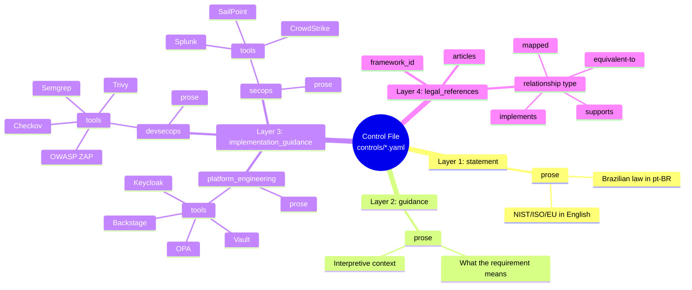
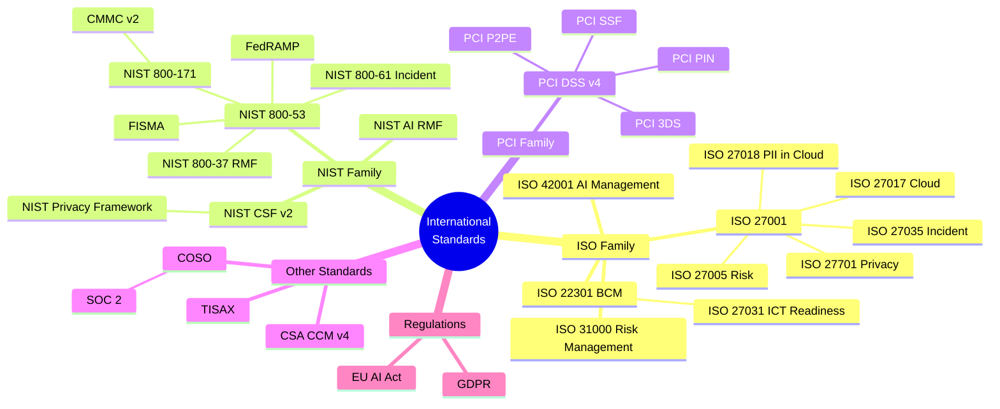
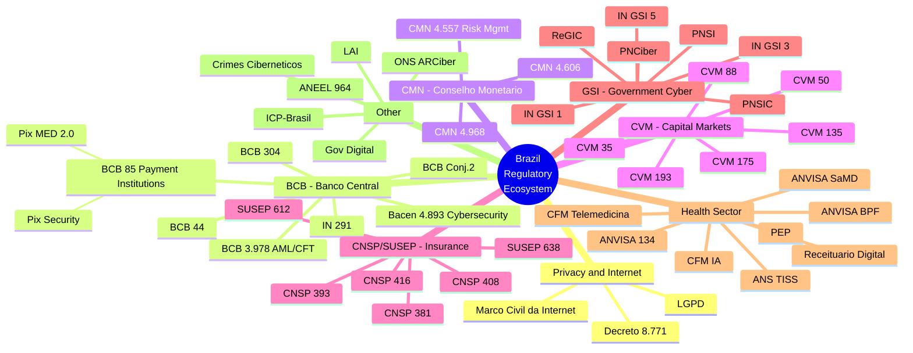
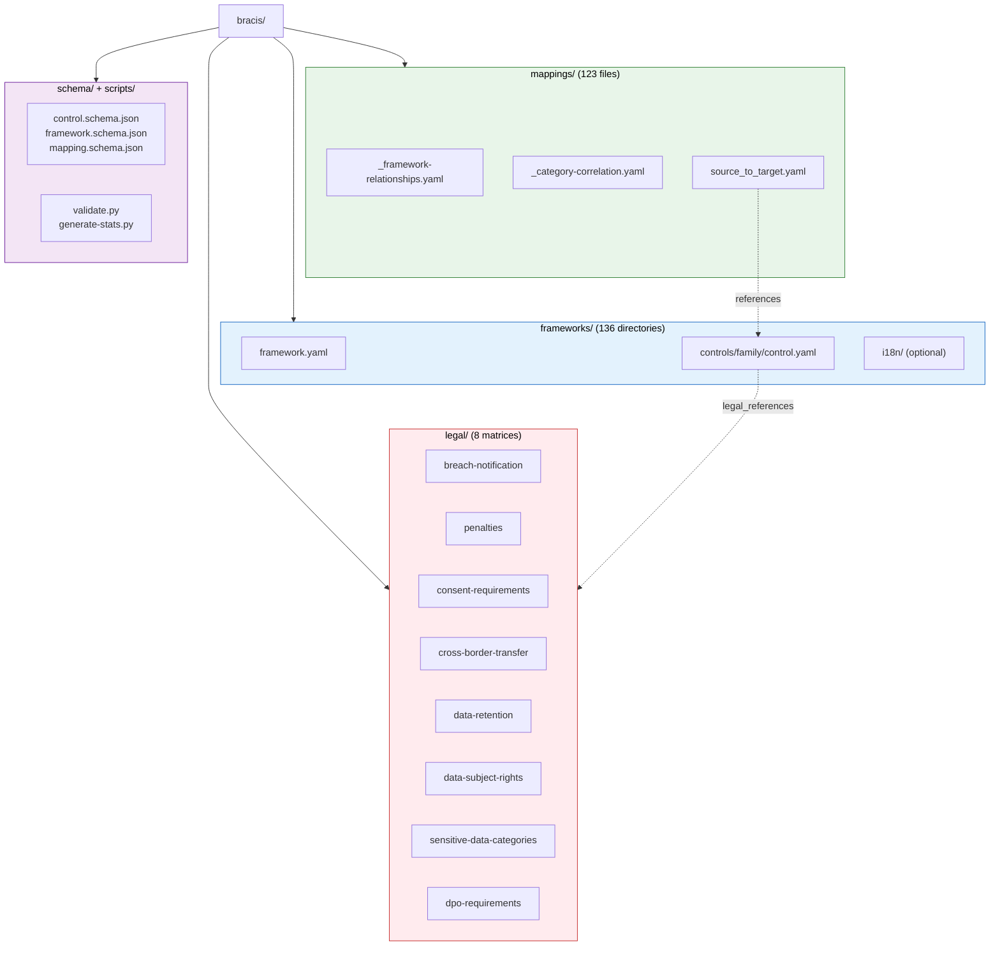
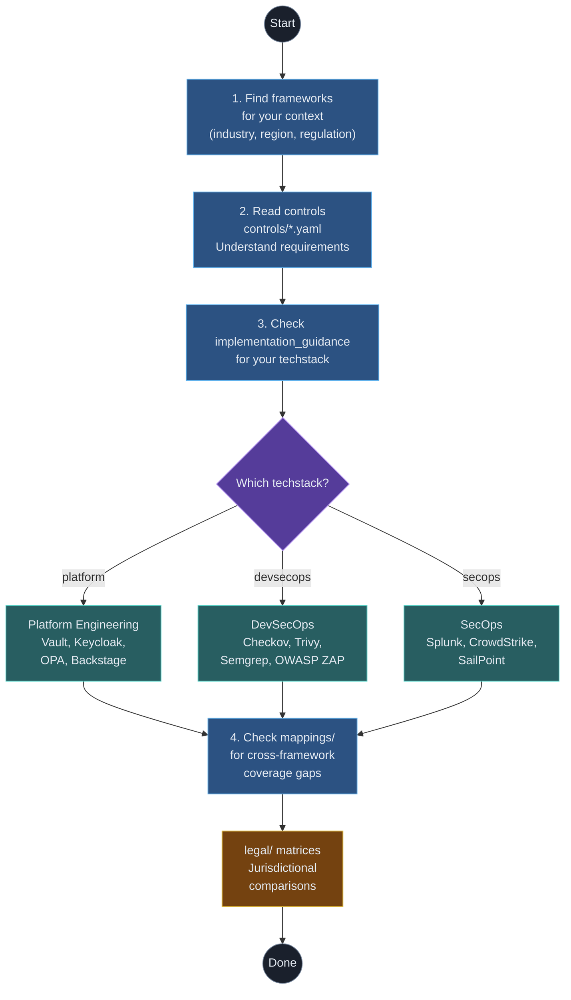

[Leia em Portugues](diagrams-engineering.pt-BR.md)

# Engineering Diagrams

Visual guides for developers, DevSecOps, and platform engineers working with BRACIS.

---

## 1. Three-Layer Control Architecture

Every control file (`controls/*.yaml`) follows a consistent four-layer structure. Layer 1 preserves the original regulatory text verbatim (in its source language). Layer 2 provides interpretive guidance in English. Layer 3 breaks implementation down by techstack, each with concrete tooling. Layer 4 links the control to related frameworks.

---

## 2. Framework Derivation Chains -- International

This diagram maps the derivation and complementarity relationships between international standards organized by family. The ISO family radiates from 27001, the NIST family from 800-53, and the PCI family from DSS v4.

**Legend:** Each branch represents a derivation or strong relationship chain. ISO 42001 and NIST AI RMF are equivalent. ISO 27018 complements GDPR. CSA CCM v4 complements ISO 27017.

---

## 3. Framework Derivation Chains -- Brazil

The Brazilian regulatory ecosystem is heavily interconnected. Sector-specific regulators (BCB, CVM, SUSEP, ANATEL, ANVISA) derive cybersecurity and privacy requirements from the LGPD and sector-specific norms, often referencing each other.

**Legend:** Each top-level branch groups frameworks by regulator or sector. BCB norms derive from Bacen 4.893. CNSP/SUSEP derive from CMN risk governance. GSI norms flow from PNSI. Health norms relate to both LGPD and sector-specific regulators.

---

## 4. Repository Structure

The repository follows a flat, predictable structure. Each of the 136 frameworks lives in its own directory under `frameworks/`, containing the metadata, controls organized by family, and optional translations. Cross-framework mappings and legal matrices are kept at the top level.

---

## 5. Developer Workflow

This is the typical workflow for an engineer using BRACIS. Start by identifying which frameworks apply to your context, then drill into the controls for implementation details targeting your specific techstack. Use the mappings to find cross-framework coverage gaps.

