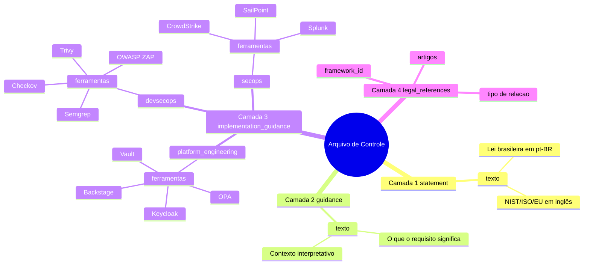
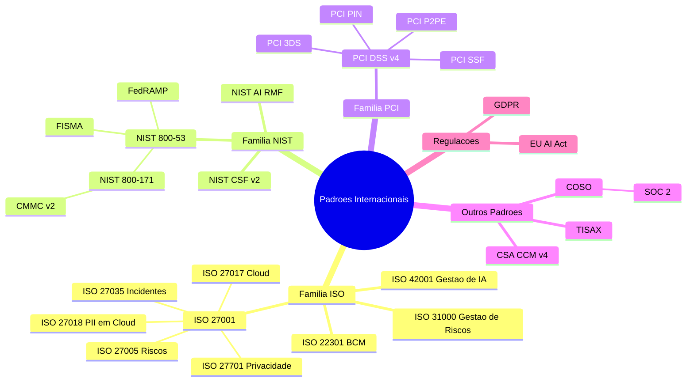
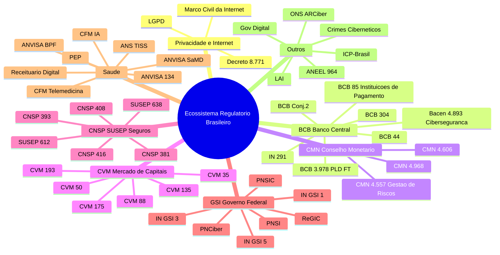
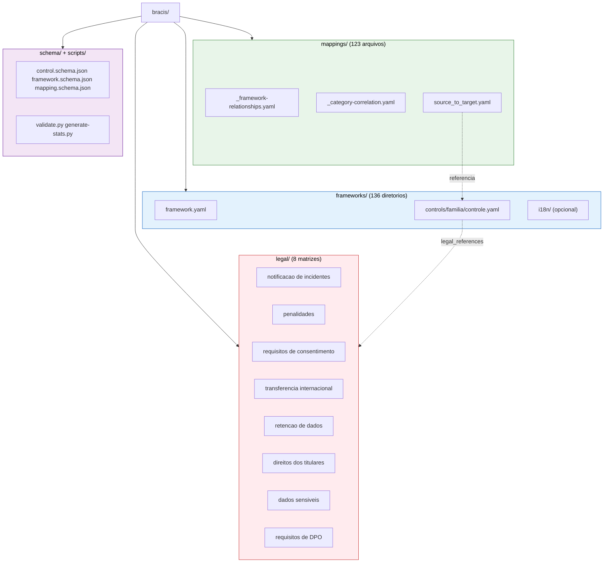
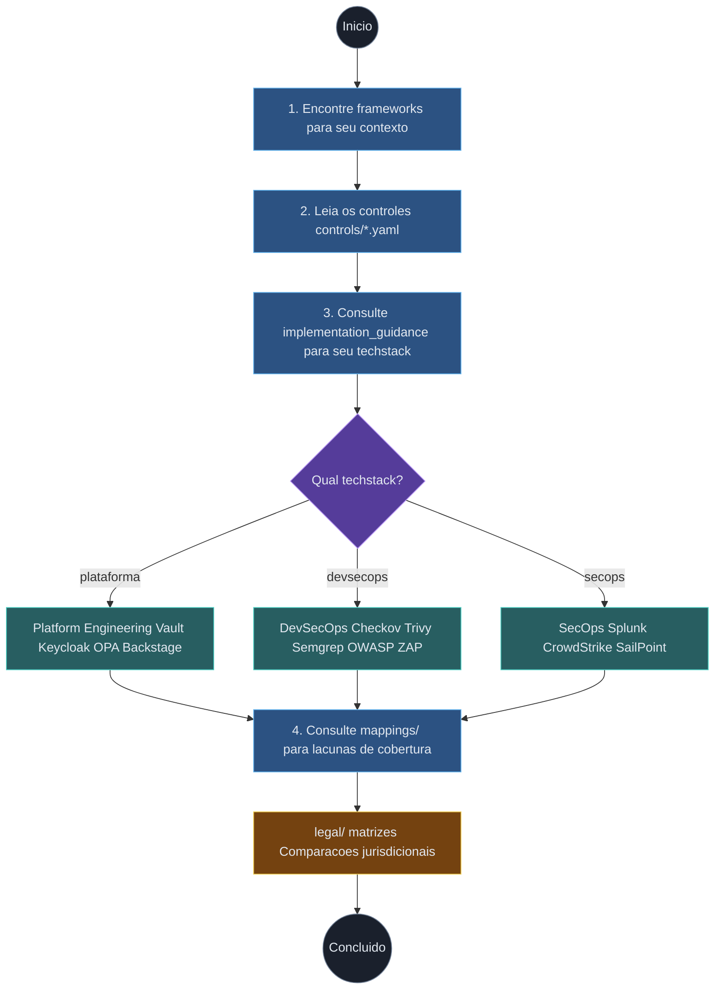

[Read in English](diagrams-engineering.md)

# Diagramas de Engenharia

Guias visuais para desenvolvedores, profissionais de DevSecOps e engenheiros de plataforma que trabalham com o BRACIS.

---

## 1. Arquitetura de Três Camadas de Controle

Cada arquivo de controle (`controls/*.yaml`) segue uma estrutura consistente de quatro camadas. A Camada 1 preserva o texto regulatório original na íntegra (no idioma de origem). A Camada 2 fornece orientação interpretativa em inglês. A Camada 3 detalha a implementação por techstack, com ferramentas concretas. A Camada 4 vincula o controle a frameworks relacionados.

---

## 2. Cadeias de Derivação de Frameworks -- Internacional

Este diagrama mapeia as relacoes de derivacao e complementaridade entre padroes internacionais organizados por familia.

---

## 3. Cadeias de Derivação de Frameworks -- Brasil

O ecossistema regulatório brasileiro é fortemente interconectado. Reguladores setoriais derivam requisitos de cibersegurança e privacidade da LGPD e normas setoriais específicas.

---

## 4. Estrutura do Repositório

O repositório segue uma estrutura plana e previsível. Cada um dos 136 frameworks vive em seu próprio diretório em `frameworks/`, contendo os metadados, controles organizados por família e traduções opcionais.

---

## 5. Fluxo de Trabalho do Engenheiro

Este é o fluxo típico de um engenheiro usando o BRACIS. Comece identificando quais frameworks se aplicam ao seu contexto, depois explore os controles para detalhes de implementação no seu techstack.

