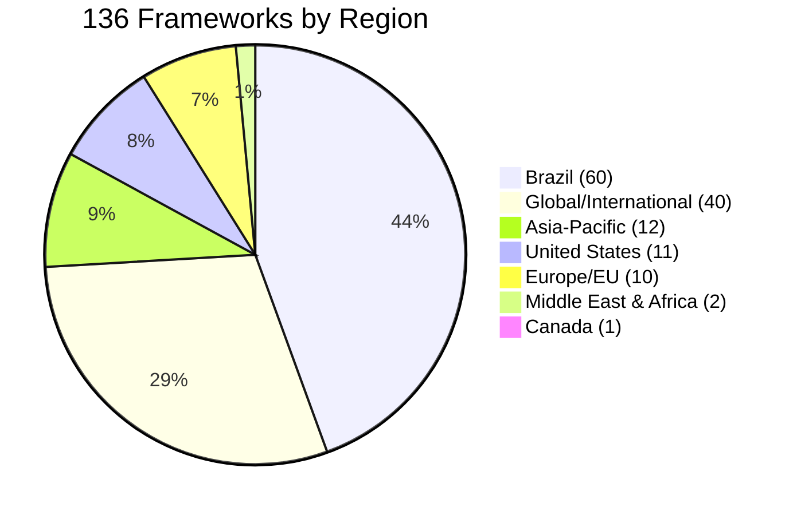
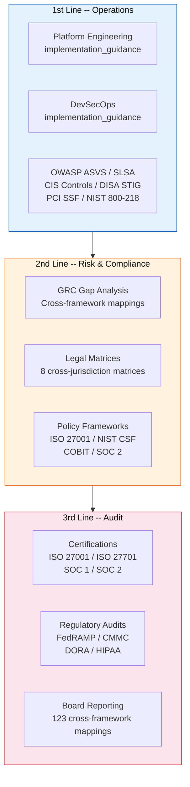
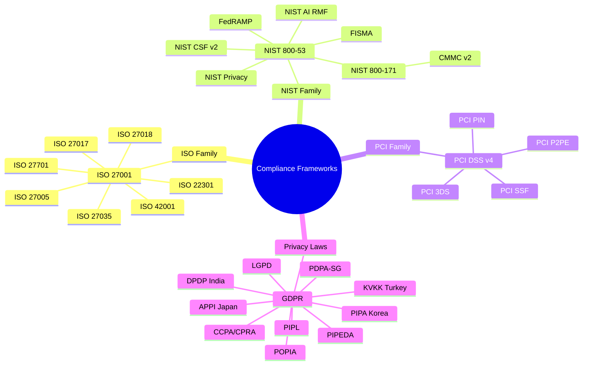
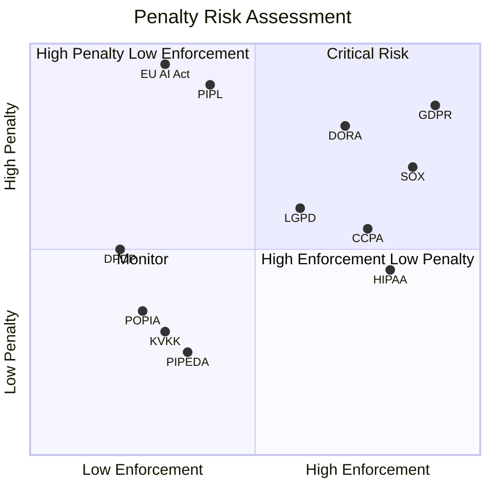
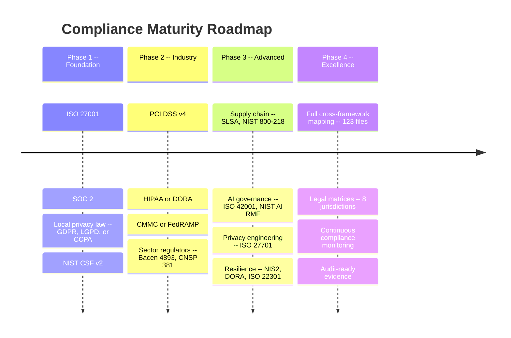
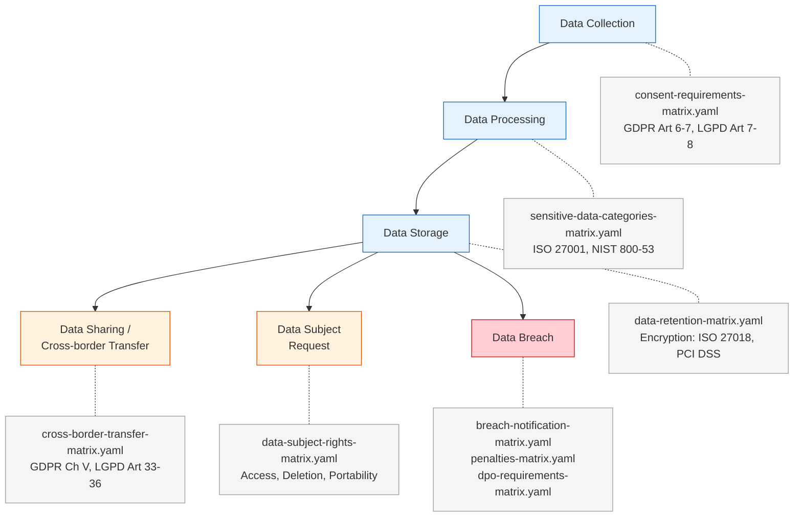
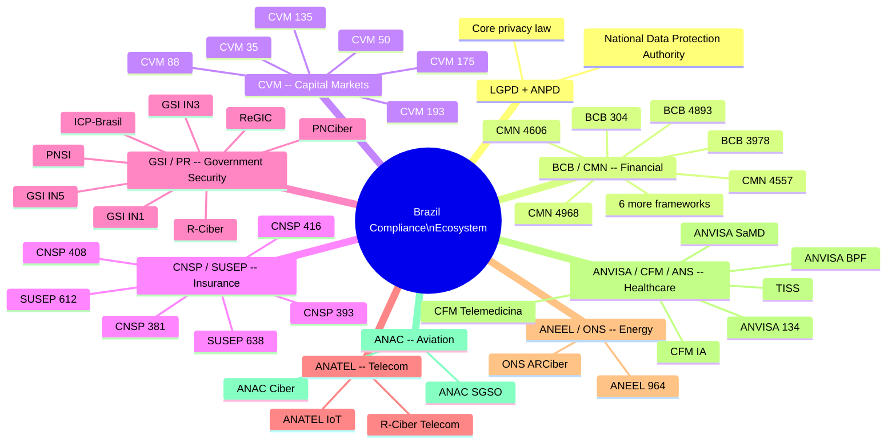

[Leia em Portugues](diagrams-executive.pt-BR.md)

# Executive Diagrams

Strategic compliance landscape visualizations for C-level executives, board members, and GRC leadership.

This document presents 136 regulatory frameworks and 2,800+ controls as strategic assets. Each diagram answers a question that matters at the board level: where we have coverage, where the gaps are, and what to prioritize next.

---

## 1. Global Regulatory Coverage

Our framework library spans every major regulatory region. The chart below shows the distribution across geographies, making it clear where your compliance investment delivers the most coverage.

**Key takeaway:** Brazil and global standards together account for 74% of the library. Any company operating in Brazil with international clients gets immediate, deep coverage.

---

## 2. Compliance Stack Selector

Not every company needs all 136 frameworks. This decision tree helps executives identify the minimum viable compliance stack based on where the company operates and what sector it serves.

```mermaid
flowchart TD
    START["Where does your company operate?"] --> BR["Brazil"]
    START --> EU["European Union"]
    START --> US["United States"]
    START --> GLOBAL["Global SaaS"]
    START --> APAC["Asia-Pacific"]

    BR --> BR_SECTOR{"What sector?"}
    BR_SECTOR --> BR_FIN["Financial"]
    BR_SECTOR --> BR_INS["Insurance"]
    BR_SECTOR --> BR_HEALTH["Healthcare"]
    BR_SECTOR --> BR_GOV["Government"]
    BR_SECTOR --> BR_GEN["General"]

    BR_FIN --> BR_FIN_STACK["LGPD + BCB 4893\nCMN 4557 + CMN 4606\nPCI DSS + SOC 2"]
    BR_INS --> BR_INS_STACK["LGPD + CNSP 381\nCNSP 393 + SUSEP 638\nSOC 2"]
    BR_HEALTH --> BR_HEALTH_STACK["LGPD + ANVISA 134\nCFM + TISS\nISO 27001"]
    BR_GOV --> BR_GOV_STACK["LGPD + PNSI\nGSI IN1 + GSI IN3\nICP-Brasil + ReGIC"]
    BR_GEN --> BR_GEN_STACK["LGPD + Marco Civil\nISO 27001 + SOC 2"]

    EU --> EU_SECTOR{"What sector?"}
    EU_SECTOR --> EU_FIN["Financial"]
    EU_SECTOR --> EU_GEN["General"]
    EU_SECTOR --> EU_AI["AI Products"]
    EU_FIN --> EU_FIN_STACK["GDPR + DORA\nNIS2 + PCI DSS"]
    EU_GEN --> EU_GEN_STACK["GDPR + NIS2"]
    EU_AI --> EU_AI_STACK["GDPR + NIS2\nEU AI Act + ISO 42001"]

    US --> US_SECTOR{"What sector?"}
    US_SECTOR --> US_FED["Federal / DoD"]
    US_SECTOR --> US_HEALTH["Healthcare"]
    US_SECTOR --> US_FIN["Financial"]
    US_SECTOR --> US_EDU["Education"]
    US_SECTOR --> US_GEN["General"]
    US_FED --> US_FED_STACK["FedRAMP + FISMA\nNIST 800-53 + CMMC"]
    US_HEALTH --> US_HEALTH_STACK["HIPAA + HITRUST\nSOC 2"]
    US_FIN --> US_FIN_STACK["SOX + GLBA\nPCI DSS + SOC 1/2"]
    US_EDU --> US_EDU_STACK["FERPA + COPPA\nSOC 2"]
    US_GEN --> US_GEN_STACK["SOC 2 + CCPA"]

    GLOBAL --> GLOBAL_STACK["SOC 2 + ISO 27001\nGDPR + CCPA\nCSA CCM"]

    APAC --> APAC_REGION{"Which country?"}
    APAC_REGION --> SG["Singapore"]
    APAC_REGION --> AU["Australia"]
    APAC_REGION --> JP["Japan"]
    APAC_REGION --> KR["South Korea"]
    SG --> SG_STACK["PDPA-SG + MAS TRM\nISO 27001"]
    AU --> AU_STACK["Essential Eight\nAPRA CPS 234\nISO 27001"]
    JP --> JP_STACK["APPI + ISMAP\nISO 27001"]
    KR --> KR_STACK["PIPA + K-ISMS-P\nISO 27001"]

    style BR_FIN_STACK fill:#e8f5e9,stroke:#2e7d32
    style BR_INS_STACK fill:#e8f5e9,stroke:#2e7d32
    style BR_HEALTH_STACK fill:#e8f5e9,stroke:#2e7d32
    style BR_GOV_STACK fill:#e8f5e9,stroke:#2e7d32
    style BR_GEN_STACK fill:#e8f5e9,stroke:#2e7d32
    style EU_FIN_STACK fill:#e8f5e9,stroke:#2e7d32
    style EU_GEN_STACK fill:#e8f5e9,stroke:#2e7d32
    style EU_AI_STACK fill:#e8f5e9,stroke:#2e7d32
    style US_FED_STACK fill:#e8f5e9,stroke:#2e7d32
    style US_HEALTH_STACK fill:#e8f5e9,stroke:#2e7d32
    style US_FIN_STACK fill:#e8f5e9,stroke:#2e7d32
    style US_EDU_STACK fill:#e8f5e9,stroke:#2e7d32
    style US_GEN_STACK fill:#e8f5e9,stroke:#2e7d32
    style GLOBAL_STACK fill:#e8f5e9,stroke:#2e7d32
    style SG_STACK fill:#e8f5e9,stroke:#2e7d32
    style AU_STACK fill:#e8f5e9,stroke:#2e7d32
    style JP_STACK fill:#e8f5e9,stroke:#2e7d32
    style KR_STACK fill:#e8f5e9,stroke:#2e7d32
```

**Key takeaway:** Start with the smallest stack that covers your regulatory obligations. You can always expand later. The green boxes are your recommended starting points.

---

## 3. Three Lines of Defense Model

Compliance is not a single team's job. The three lines of defense model distributes responsibility across the organization. This diagram shows how BRACIS maps to each line.

**Key takeaway:** The 1st line uses implementation guidance daily. The 2nd line uses cross-framework mappings and legal matrices for continuous monitoring. The 3rd line uses certifications and mappings for audit evidence.

---

## 4. Regulatory Dependency Map

Regulations do not exist in isolation. Understanding how the major regulatory families relate to each other prevents duplicate work and reveals shared controls.

**Key takeaway:** ISO 27001 and GDPR are the two gravitational centers. Implementing ISO 27001 covers significant portions of NIST, PCI, and sector-specific frameworks. GDPR compliance creates a baseline for nearly every other privacy law.

---

## 5. Penalty Risk Landscape

Not all regulations carry equal enforcement risk. This quadrant positions key frameworks by enforcement activity and maximum penalty size, helping executives prioritize where non-compliance is most costly.

**Key takeaway:** GDPR, SOX, and DORA sit in the critical risk quadrant. The EU AI Act and PIPL carry massive penalty ceilings but lower enforcement maturity today.

---

## 6. Compliance Maturity Roadmap

Compliance is a journey, not a destination. This roadmap shows a phased approach from foundational standards to full automated compliance.

**Key takeaway:** Phase 1 alone covers 60-70% of most compliance requirements. Each subsequent phase adds depth and sector specificity. Phase 4 turns compliance from a cost center into a competitive advantage through systematic coverage.

---

## 7. Data Lifecycle and Compliance Touchpoints

Every stage of the data lifecycle triggers regulatory obligations. This diagram maps those touchpoints to the specific legal matrices and frameworks in BRACIS.

**Key takeaway:** Our 8 legal matrices cover every stage of the data lifecycle across 17 jurisdictions. A data breach triggers 3 matrices simultaneously — preparation here has the highest risk-reduction ROI.

---

## 8. Brazil Regulatory Ecosystem

Brazil has one of the most complex regulatory landscapes for technology companies, with 60 frameworks across 10+ regulators. This map shows the major regulatory bodies organized by sector, with LGPD as the connective thread across all of them.

**Key takeaway:** LGPD is the thread that connects every sector in Brazil. Financial services is the most heavily regulated sector with 22 frameworks across 4 regulators. Any company operating in Brazil's financial sector must plan for significant compliance investment.
