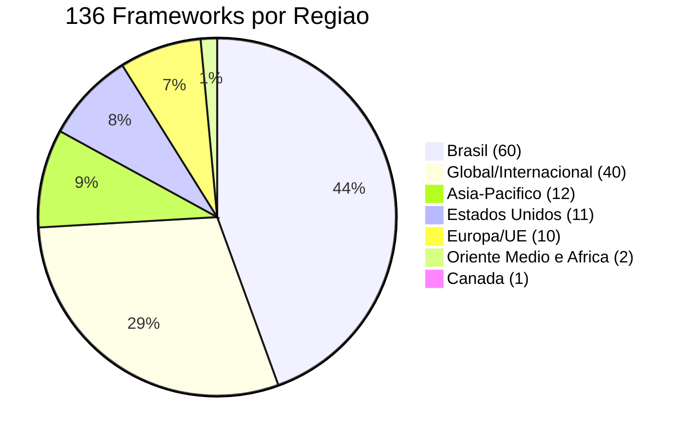
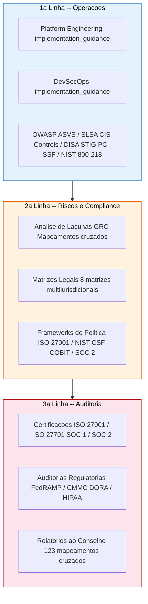
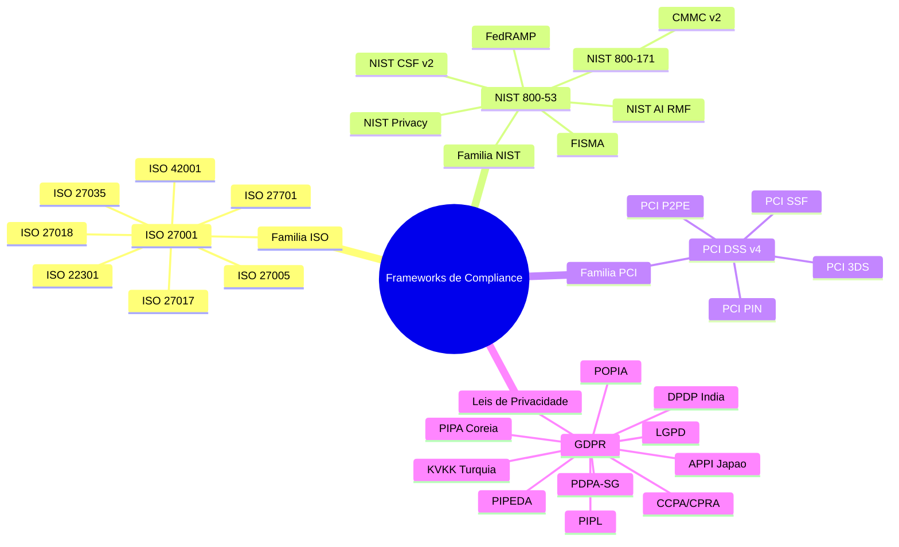
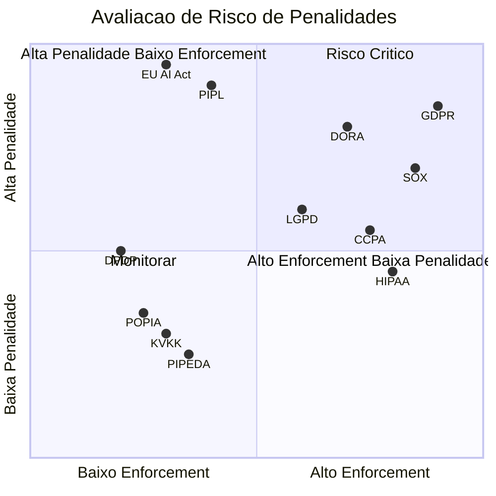
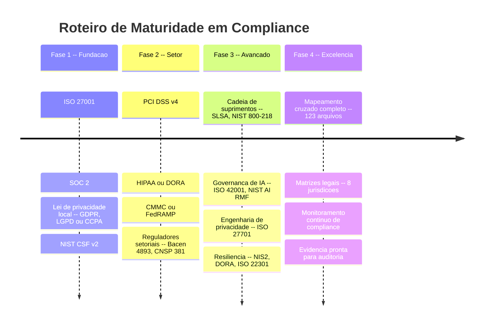
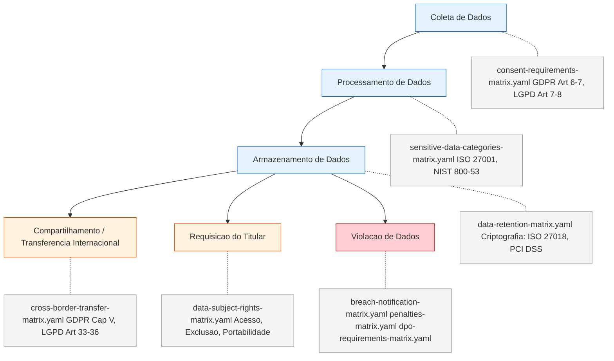
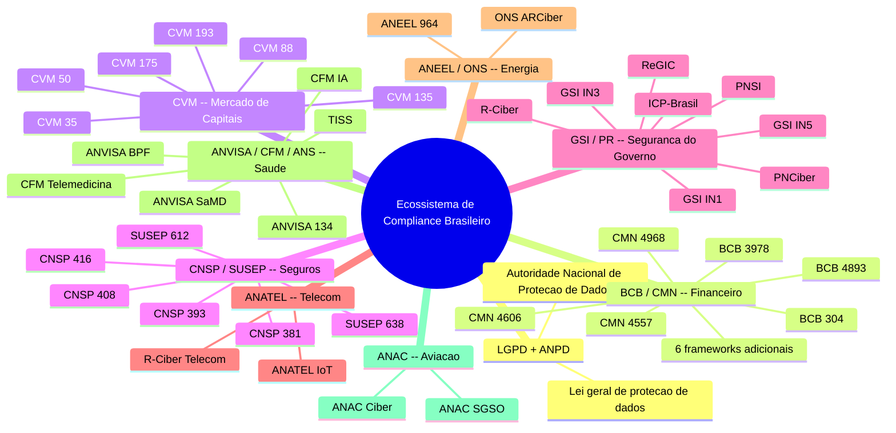

[Read in English](diagrams-executive.md)

# Diagramas Executivos

Visualizacoes estrategicas do panorama de compliance para executivos, conselhos e lideranca de GRC.

Este documento apresenta 136 frameworks regulatórios e mais de 2.800 controles como ativos estratégicos. Cada diagrama responde a uma pergunta relevante para a liderança: onde temos cobertura, onde estão as lacunas e o que priorizar.

---

## 1. Cobertura Regulatória Global

Nossa biblioteca de frameworks abrange todas as principais regiões regulatórias. O grafico abaixo mostra a distribuicao por geografia.

**Conclusão:** Brasil e padroes globais juntos representam 74% da biblioteca. Qualquer empresa operando no Brasil com clientes internacionais obtem cobertura imediata e profunda.

---

## 2. Seletor de Stack de Compliance

Nem toda empresa precisa de todos os 136 frameworks. Esta árvore de decisão ajuda executivos a identificar o stack mínimo de compliance com base em onde a empresa opera e qual setor atende.

```mermaid
flowchart TD
    START["Onde sua empresa opera?"] --> BR["Brasil"]
    START --> EU["Uniao Europeia"]
    START --> US["Estados Unidos"]
    START --> GLOBAL["SaaS Global"]
    START --> APAC["Asia-Pacifico"]

    BR --> BR_SECTOR{"Qual setor?"}
    BR_SECTOR --> BR_FIN["Financeiro"]
    BR_SECTOR --> BR_INS["Seguros"]
    BR_SECTOR --> BR_HEALTH["Saude"]
    BR_SECTOR --> BR_GOV["Governo"]
    BR_SECTOR --> BR_GEN["Geral"]

    BR_FIN --> BR_FIN_STACK["LGPD + BCB 4893 CMN 4557 + CMN 4606 PCI DSS + SOC 2"]
    BR_INS --> BR_INS_STACK["LGPD + CNSP 381 CNSP 393 + SUSEP 638 SOC 2"]
    BR_HEALTH --> BR_HEALTH_STACK["LGPD + ANVISA 134 CFM + TISS ISO 27001"]
    BR_GOV --> BR_GOV_STACK["LGPD + PNSI GSI IN1 + GSI IN3 ICP-Brasil + ReGIC"]
    BR_GEN --> BR_GEN_STACK["LGPD + Marco Civil ISO 27001 + SOC 2"]

    EU --> EU_SECTOR{"Qual setor?"}
    EU_SECTOR --> EU_FIN["Financeiro"]
    EU_SECTOR --> EU_GEN["Geral"]
    EU_SECTOR --> EU_AI["Produtos de IA"]
    EU_FIN --> EU_FIN_STACK["GDPR + DORA NIS2 + PCI DSS"]
    EU_GEN --> EU_GEN_STACK["GDPR + NIS2"]
    EU_AI --> EU_AI_STACK["GDPR + NIS2 EU AI Act + ISO 42001"]

    US --> US_SECTOR{"Qual setor?"}
    US_SECTOR --> US_FED["Federal / DoD"]
    US_SECTOR --> US_HEALTH["Saude"]
    US_SECTOR --> US_FIN["Financeiro"]
    US_SECTOR --> US_EDU["Educacao"]
    US_SECTOR --> US_GEN["Geral"]
    US_FED --> US_FED_STACK["FedRAMP + FISMA NIST 800-53 + CMMC"]
    US_HEALTH --> US_HEALTH_STACK["HIPAA + HITRUST SOC 2"]
    US_FIN --> US_FIN_STACK["SOX + GLBA PCI DSS + SOC 1/2"]
    US_EDU --> US_EDU_STACK["FERPA + COPPA SOC 2"]
    US_GEN --> US_GEN_STACK["SOC 2 + CCPA"]

    GLOBAL --> GLOBAL_STACK["SOC 2 + ISO 27001 GDPR + CCPA CSA CCM"]

    APAC --> APAC_REGION{"Qual pais?"}
    APAC_REGION --> SG["Singapura"]
    APAC_REGION --> AU["Australia"]
    APAC_REGION --> JP["Japao"]
    APAC_REGION --> KR["Coreia do Sul"]
    SG --> SG_STACK["PDPA-SG + MAS TRM ISO 27001"]
    AU --> AU_STACK["Essential Eight APRA CPS 234 ISO 27001"]
    JP --> JP_STACK["APPI + ISMAP ISO 27001"]
    KR --> KR_STACK["PIPA + K-ISMS-P ISO 27001"]

    style BR_FIN_STACK fill:#e8f5e9,stroke:#2e7d32
    style BR_INS_STACK fill:#e8f5e9,stroke:#2e7d32
    style BR_HEALTH_STACK fill:#e8f5e9,stroke:#2e7d32
    style BR_GOV_STACK fill:#e8f5e9,stroke:#2e7d32
    style BR_GEN_STACK fill:#e8f5e9,stroke:#2e7d32
    style EU_FIN_STACK fill:#e8f5e9,stroke:#2e7d32
    style EU_GEN_STACK fill:#e8f5e9,stroke:#2e7d32
    style EU_AI_STACK fill:#e8f5e9,stroke:#2e7d32
    style US_FED_STACK fill:#e8f5e9,stroke:#2e7d32
    style US_HEALTH_STACK fill:#e8f5e9,stroke:#2e7d32
    style US_FIN_STACK fill:#e8f5e9,stroke:#2e7d32
    style US_EDU_STACK fill:#e8f5e9,stroke:#2e7d32
    style US_GEN_STACK fill:#e8f5e9,stroke:#2e7d32
    style GLOBAL_STACK fill:#e8f5e9,stroke:#2e7d32
    style SG_STACK fill:#e8f5e9,stroke:#2e7d32
    style AU_STACK fill:#e8f5e9,stroke:#2e7d32
    style JP_STACK fill:#e8f5e9,stroke:#2e7d32
    style KR_STACK fill:#e8f5e9,stroke:#2e7d32
```

**Conclusão:** Comece com o menor stack que cobre suas obrigacoes regulatorias. Voce sempre pode expandir depois. As caixas verdes sao os pontos de partida recomendados.

---

## 3. Modelo das Três Linhas de Defesa

O compliance não é responsabilidade de uma única equipe. Este diagrama mostra como o BRACIS se mapeia a cada linha de defesa.

**Conclusão:** A 1a linha usa a implementation_guidance diariamente. A 2a linha usa mapeamentos cruzados e matrizes legais para monitoramento continuo. A 3a linha usa certificacoes e mapeamentos como evidencia de auditoria.

---

## 4. Mapa de Dependência Regulatória

Regulações não existem de forma isolada. Entender como as principais famílias regulatórias se relacionam evita trabalho duplicado e revela controles compartilhados.

**Conclusão:** ISO 27001 e GDPR sao os dois centros gravitacionais. Implementar ISO 27001 cobre parcelas significativas do NIST, PCI e frameworks setoriais. Conformidade com GDPR cria uma baseline para quase toda outra lei de privacidade.

---

## 5. Panorama de Risco de Penalidades

Nem todas as regulações carregam o mesmo risco de enforcement. Este quadrante posiciona os principais frameworks por atividade de fiscalização e tamanho máximo de penalidade.

**Conclusão:** GDPR, SOX e DORA estao no quadrante de risco critico. O EU AI Act e o PIPL carregam tetos de penalidade massivos mas enforcement ainda em maturacao.

---

## 6. Roteiro de Maturidade em Compliance

Compliance e uma jornada, nao um destino. Este roteiro mostra uma abordagem em fases, de padroes fundacionais ate cobertura sistematica.

**Conclusão:** A Fase 1 sozinha cobre 60-70% da maioria dos requisitos de compliance. Cada fase subsequente adiciona profundidade e especificidade setorial.

---

## 7. Ciclo de Vida de Dados e Pontos de Contato Regulatório

Cada etapa do ciclo de vida de dados aciona obrigações regulatórias. Este diagrama mapeia esses pontos de contato para as matrizes legais específicas do BRACIS.

**Conclusão:** Nossas 8 matrizes legais cobrem cada etapa do ciclo de vida de dados em 17 jurisdicoes. Uma violacao de dados aciona 3 matrizes simultaneamente -- a preparacao aqui tem o maior ROI de reducao de risco.

---

## 8. Ecossistema Regulatório Brasileiro

O Brasil possui um dos panoramas regulatórios mais complexos para empresas de tecnologia, com 60 frameworks distribuídos entre mais de 10 reguladores. Este mapa mostra os principais órgãos reguladores organizados por setor, com a LGPD como fio condutor transversal.

**Conclusão:** A LGPD e o fio que conecta todos os setores no Brasil. O setor financeiro e o mais regulado, com 22 frameworks distribuidos entre 4 reguladores. Qualquer empresa operando no setor financeiro brasileiro deve planejar investimento significativo em compliance.
