[Read in English](diagrams-legal.md)

# Panorama Regulatório Brasileiro

Diagramas visuais do ecossistema regulatório brasileiro para advogados, DPOs, encarregados de dados e times jurídicos. Abrange privacidade, setor financeiro, governo, saúde, infraestrutura crítica e telecomunicações.

---

## 1. Ecossistema Regulatório Brasileiro -- Visão Geral

O Brasil possui um dos ecossistemas regulatórios mais fragmentados do mundo, com 60 frameworks setoriais emitidos por mais de uma dezena de órgãos reguladores. Este mindmap organiza todos os 60 frameworks por regulador ou domínio, facilitando a identificação de quais normas se aplicam a cada tipo de organização.

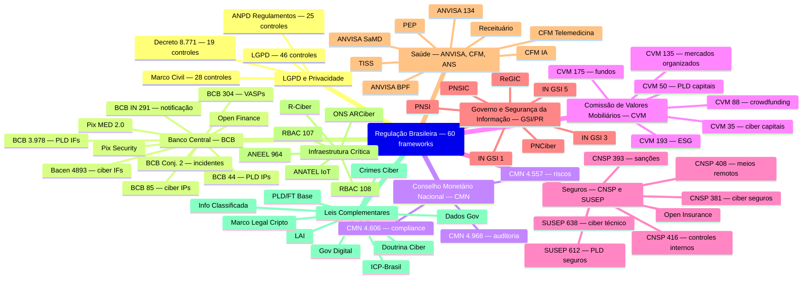

---

## 2. LGPD -- Direitos dos Titulares

A LGPD confere aos titulares de dados pessoais um conjunto abrangente de direitos, concentrados no art. 18, com complemento no art. 20 para decisões automatizadas. Esses direitos podem ser exercidos a qualquer momento mediante requisição ao controlador ou ao encarregado de dados.

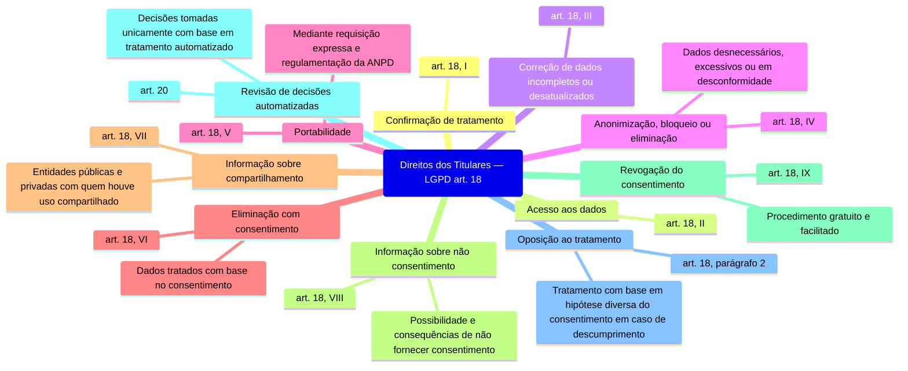

---

## 3. LGPD -- Bases Legais para Tratamento

O tratamento de dados pessoais no Brasil só é lícito quando enquadrado em uma das dez bases legais taxativamente previstas no art. 7 da LGPD. O consentimento não é hierarquicamente superior às demais bases — cada hipótese é independente e autossuficiente.

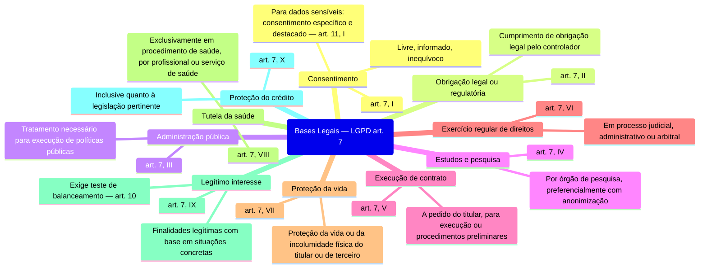

---

## 4. Setor Financeiro -- Hierarquia Regulatória

O sistema financeiro brasileiro é regulado por uma estrutura hierárquica de conselhos e autarquias. O CMN define políticas macro, que são implementadas pelo BCB e pela CVM. No mercado de seguros, o CNSP desempenha papel análogo, com a SUSEP como supervisora. Cada regulador emite normas setoriais específicas de cibersegurança, PLD/FT e controles internos.

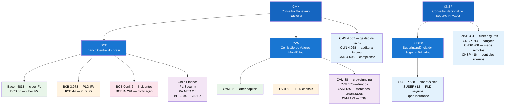

**Legenda de cores:** azul = órgão regulador, verde = cibersegurança, laranja = PLD/FT, rosa = incidentes, roxo = ecossistemas abertos e mercados.

---

## 5. Três Linhas de Defesa -- Regulação Financeira Brasileira

O modelo de três linhas de defesa é a espinha dorsal da governança financeira no Brasil. A primeira linha (operações) implementa controles no dia a dia. A segunda linha (riscos e compliance) supervisiona e monitora. A terceira linha (auditoria) avalia independentemente a eficácia das duas primeiras.

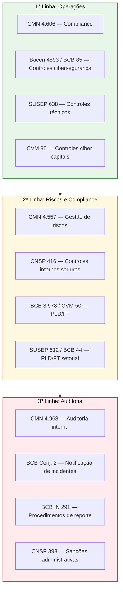

---

## 6. Governo Federal -- Cadeia de Comando de Segurança da Informação

A segurança da informação no governo federal brasileiro é estruturada em uma cadeia hierárquica que parte da Presidência da República, passa pelo GSI/PR e se desdobra em políticas nacionais, instruções normativas e procedimentos operacionais. As INs do GSI possuem interseções diretas com NIST 800-53 e ISO 27001.

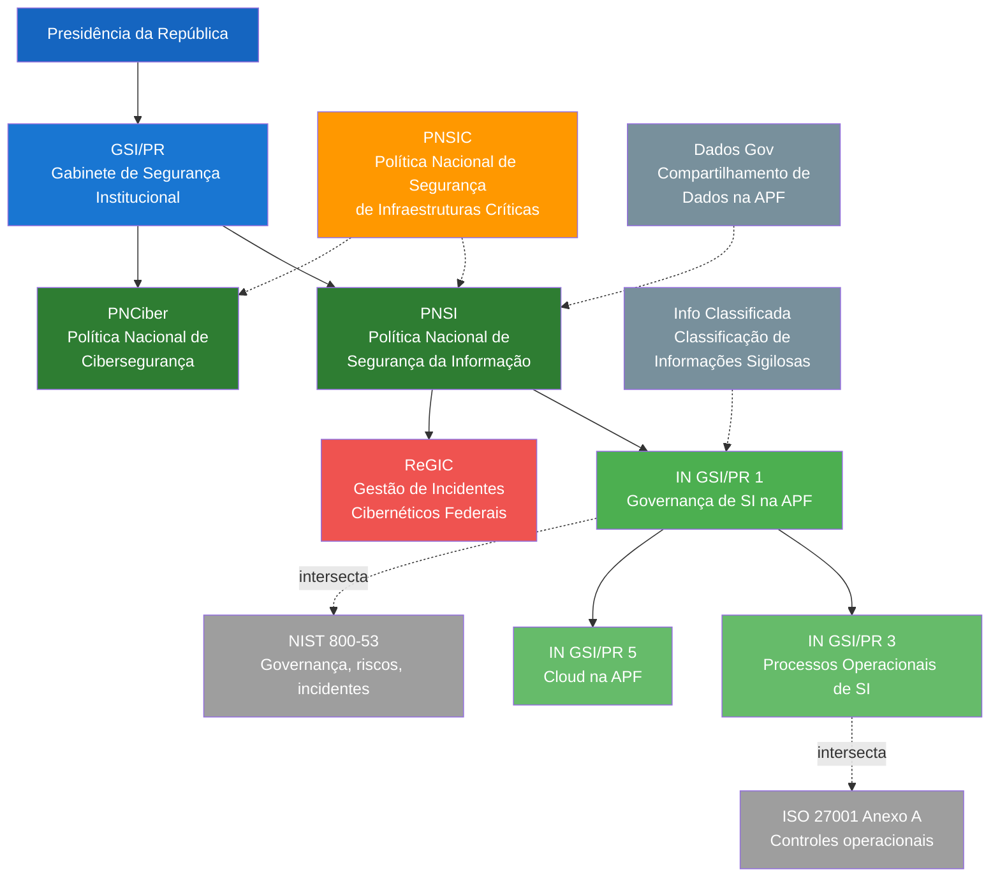

**Legenda:** linhas contínuas = derivação direta; linhas tracejadas = complementa ou intersecta.

---

## 7. Saúde -- Ecossistema Regulatório

A regulação de saúde digital no Brasil é fragmentada entre três órgãos principais: ANVISA (dispositivos médicos e farma), CFM (exercício profissional médico) e ANS (saúde suplementar). A LGPD permeia todo o ecossistema como camada transversal de proteção de dados de saúde, e frameworks internacionais como IEC 62443, EU AI Act e NIST AI RMF possuem interseções relevantes.

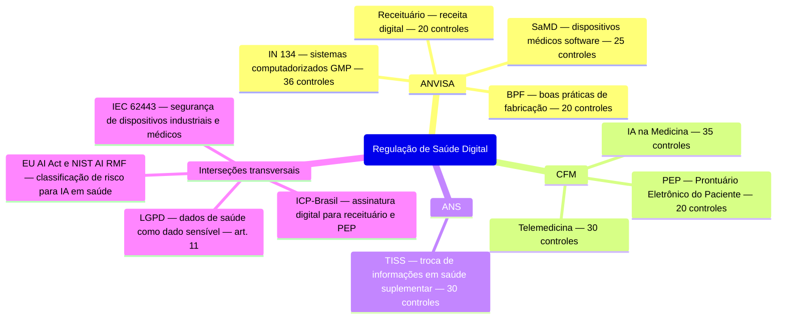

---

## 8. Infraestrutura Crítica -- Mapa Setorial

A Política Nacional de Segurança de Infraestruturas Críticas (PNSIC) é o guarda-chuva que abrange energia, telecomunicações, aviação e outros setores essenciais. Cada setor possui seu regulador específico e normas próprias de cibersegurança, mas todos convergem na LGPD, PNSI e PNCiber como camadas transversais.

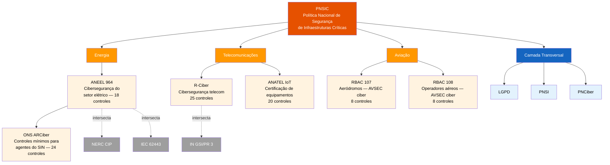

---

## 9. PLD/FT -- Cadeia de Prevenção à Lavagem de Dinheiro

A prevenção à lavagem de dinheiro e ao financiamento do terrorismo no Brasil parte da Lei 9.613/1998, que define as obrigações gerais, e se desdobra em normas setoriais para cada segmento regulado. O fluxo operacional obrigatório segue a cadeia KYC, monitoramento, comunicação ao COAF e aplicação de sanções.

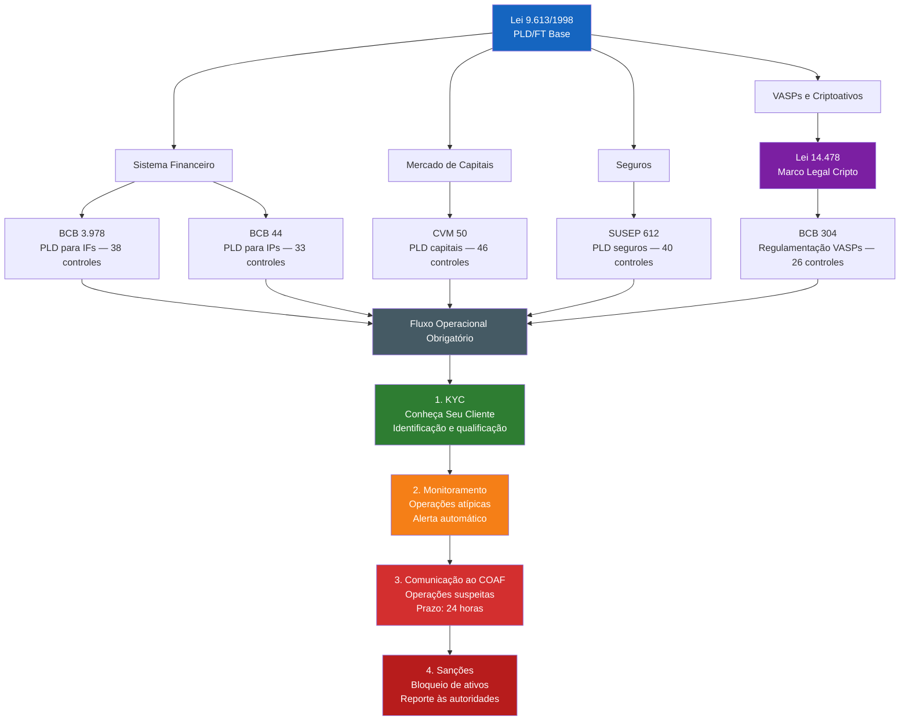

---

## 10. Notificação de Incidentes -- Fluxo Obrigatório

Quando um incidente de segurança ocorre, múltiplas obrigações de notificação podem se sobrepor simultaneamente. Um vazamento de dados pessoais em uma instituição financeira, por exemplo, exige notificação paralela à ANPD, ao BCB e potencialmente ao CTIR Gov. Este fluxograma mapeia a árvore de decisão para cada cenário.

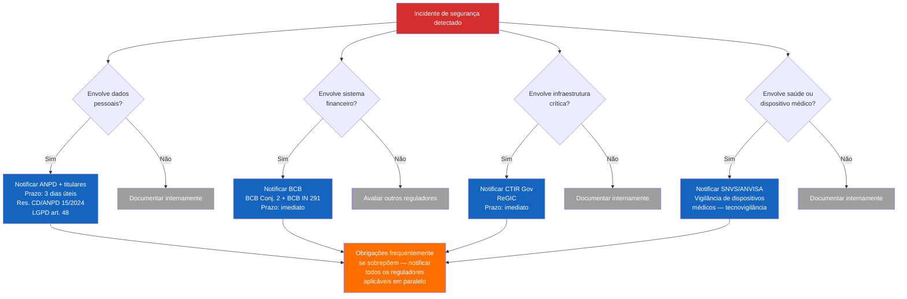

**Resumo de prazos de notificação:**

| Regulador | Framework | Prazo | Destinatário |
|-----------|-----------|-------|--------------|
| ANPD | LGPD + Res. 15/2024 | 3 dias úteis | ANPD + titulares afetados |
| BCB | BCB Conj. 2 + IN 291 | Imediato | BCB (DESIN) |
| CTIR Gov | ReGIC | Imediato | CTIR Gov |
| ANVISA | Tecnovigilância | Conforme gravidade | SNVS |

---

## 11. Penalidades por Regulador

As penalidades no ecossistema regulatório brasileiro variam significativamente em severidade máxima e frequência de aplicação. A ANPD ainda está em fase de maturação de enforcement, enquanto BCB e CVM possuem histórico consolidado de aplicação de multas e sanções administrativas.

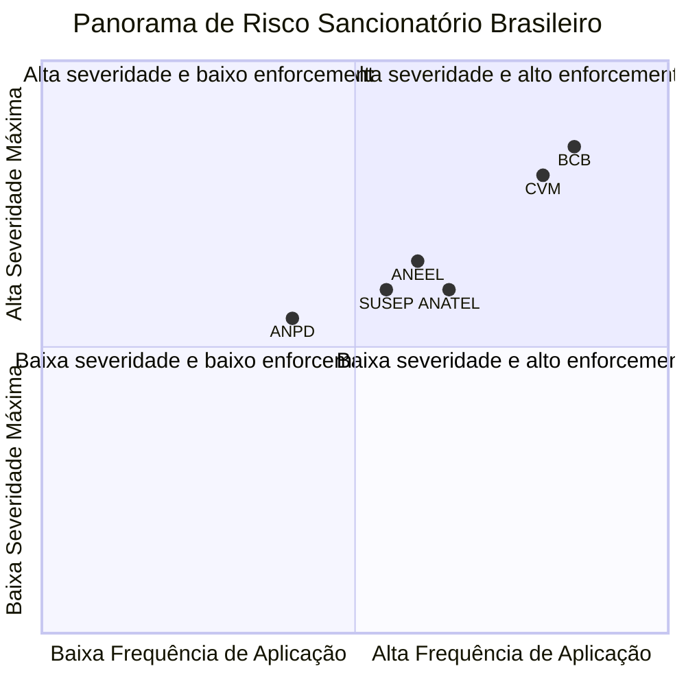

**Detalhamento de penalidades por regulador:**

| Regulador | Penalidade máxima | Sanções adicionais |
|-----------|-------------------|--------------------|
| ANPD (LGPD) | Até R$ 50M por infração ou 2% do faturamento | Publicização, bloqueio/eliminação de dados, suspensão do tratamento |
| BCB | Multa sem teto definido | Suspensão de atividades, intervenção, liquidação extrajudicial |
| CVM | Até R$ 50M | Inabilitação, cassação de registro, suspensão de exercício |
| SUSEP | Multa conforme regulamentação | Suspensão de atividades, cassação de autorização |
| ANEEL | Multa conforme regulamentação | Revogação de autorização, caducidade de concessão |
| ANATEL | Multa conforme regulamentação | Caducidade da outorga, cassação de licença |

---

## 12. Linha do Tempo -- Evolução Regulatória Brasileira

A regulação de cibersegurança e privacidade no Brasil evoluiu rapidamente na última década. O Marco Civil da Internet (2014) estabeleceu os princípios fundacionais, a LGPD (2018) inaugurou a era de proteção de dados, e desde 2020 uma onda de normas setoriais tem densificado o ecossistema em finanças, governo, energia, telecomunicações e saúde.

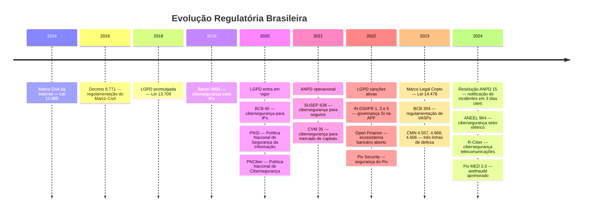
