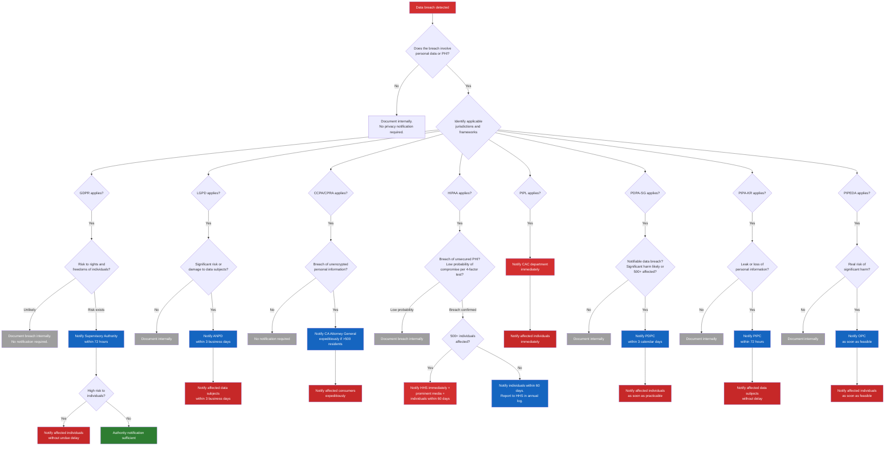
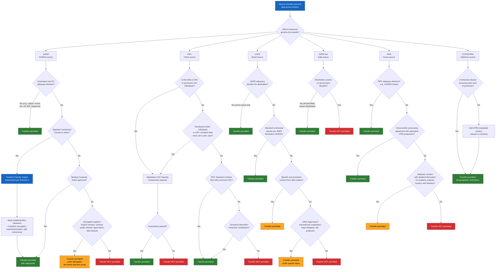
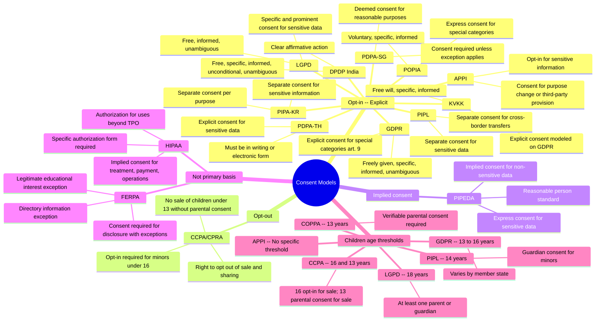
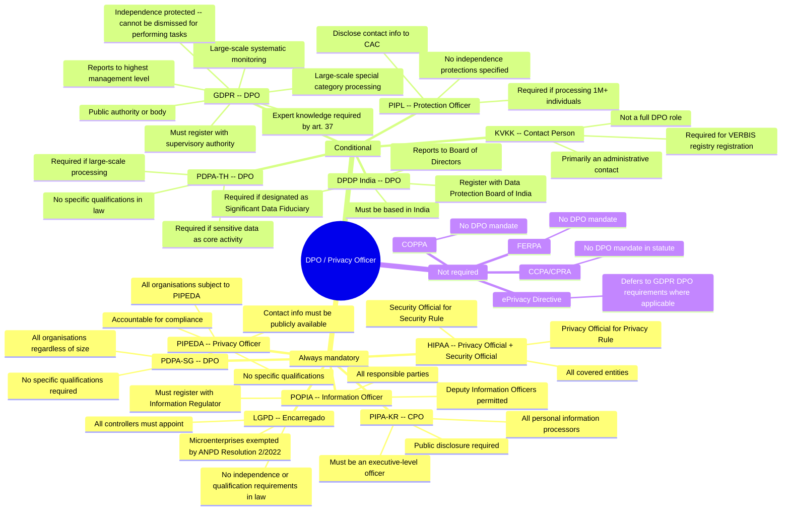
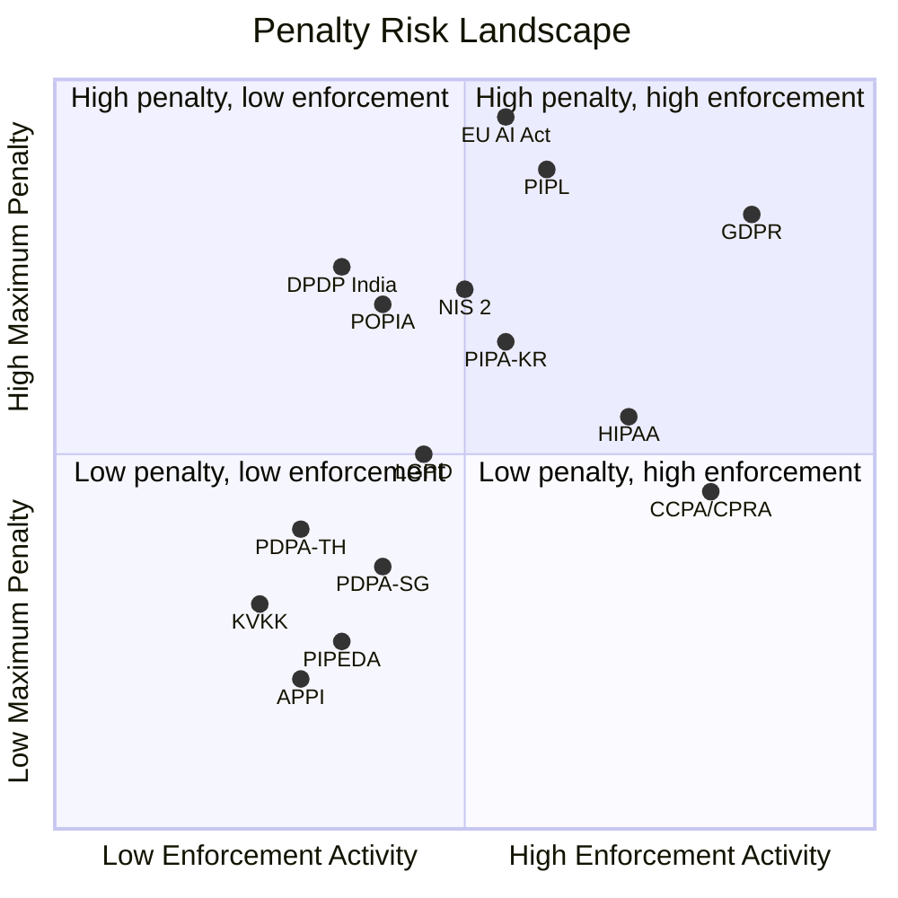
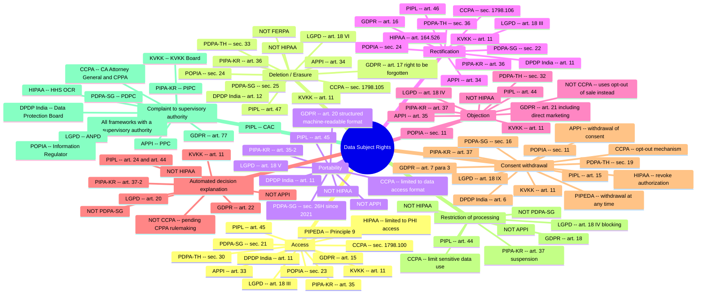
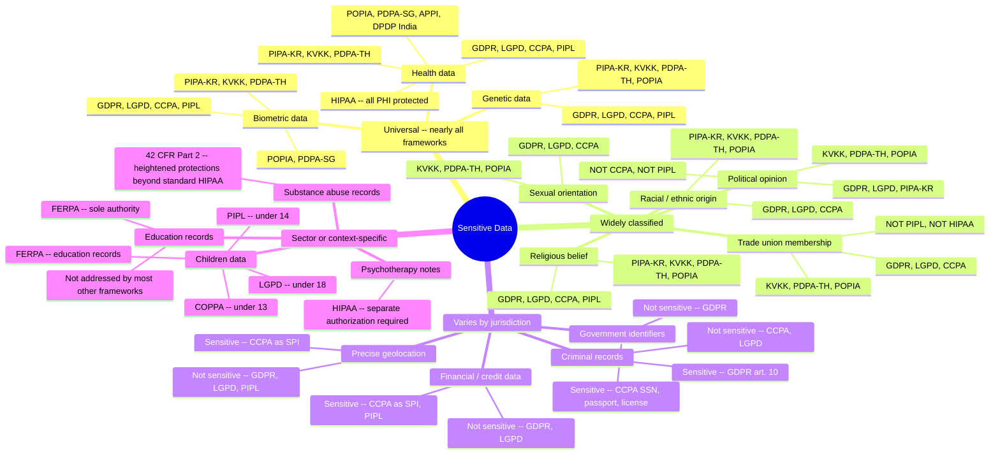
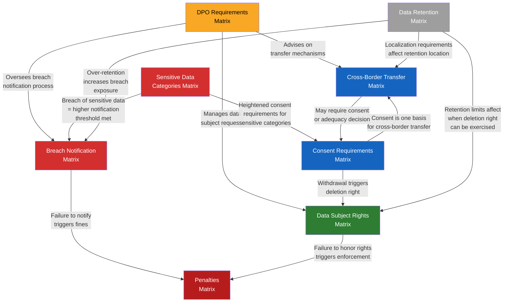

[Leia em Portugues](diagrams-legal.pt-BR.md) _(em breve)_

# Legal Diagrams

Visual decision trees and comparison charts for legal teams, DPOs, and compliance officers working with the BRACIS. Each diagram uses a distinct Mermaid type -- vertical flowcharts for decision trees, mindmaps for classification views, and a quadrant chart for penalty positioning.

---

## 1. Breach Notification Decision Tree

When a data breach occurs, the response timeline and notification obligations vary dramatically by jurisdiction. This vertical decision tree guides the initial triage: determine whether notification is required, to whom, and within what deadline. Diamond shapes represent decisions; the risk threshold differs per framework.

**Key deadline summary:**

| Framework | Authority deadline | Individual deadline |
|-----------|-------------------|-------------------|
| GDPR | 72 hours | Without undue delay (high risk) |
| LGPD | 3 business days | 3 business days |
| CCPA/CPRA | Expeditiously | Expeditiously |
| HIPAA | 60 days (immediate if 500+) | 60 days |
| PIPL | Immediately | Immediately |
| PDPA-SG | 3 calendar days | As soon as practicable |
| PIPA-KR | 72 hours | Without delay |
| PIPEDA | As soon as feasible | As soon as feasible |

---

## 2. Cross-Border Data Transfer Decision Tree

International data transfers are among the most complex compliance challenges. Each framework uses a fundamentally different model: GDPR uses adequacy decisions and safeguards, PIPL uses a three-tier system with mandatory security assessments, India uses a blacklist model, and CCPA imposes no geographic restrictions at all. This vertical tree maps the decision process across the major frameworks, flowing top to bottom through adequacy, SCCs, BCRs, and derogations.

**Transfer model summary:**

| Framework | Model | Key mechanism |
|-----------|-------|---------------|
| GDPR | Adequacy + safeguards | EC adequacy decisions, SCCs + TIA, BCRs |
| PIPL | Three-tier system | CAC security assessment, SCCs, certification |
| LGPD | GDPR-inspired (maturing) | ANPD SCCs (2024), consent, legal cooperation |
| DPDP India | Blacklist model | All transfers permitted unless destination blacklisted |
| PIPA Korea | Consent + agreements | PIPC adequacy, processing agreements, detailed consent |
| CCPA/CPRA | Contractual model | No geographic restrictions; obligations travel with data |

---

## 3. Consent Requirements

Consent models differ fundamentally across jurisdictions. Most comprehensive privacy laws require affirmative opt-in consent, but the CCPA/CPRA uses primarily an opt-out model for the sale and sharing of data. HIPAA uses a sector-specific "authorization" concept distinct from general consent. This mindmap organizes all frameworks by their consent model, with children's age thresholds as a cross-cutting sub-branch.

**Children's consent age thresholds:**

| Framework | Age threshold | Notes |
|-----------|--------------|-------|
| LGPD | 18 | Parental consent required for all minors (ECA definition) |
| CCPA/CPRA | 16 / 13 | 16 for minor opt-in to sale; 13 for parental consent to sale |
| GDPR | 13-16 | Varies by member state (13: UK, BE, DK; 14: ES, IT, AT; 15: FR, CZ, GR; 16: DE, NL) |
| PIPL | 14 | Guardian consent required for minors under 14 |
| COPPA | 13 | Verifiable parental consent for children under 13 |
| APPI | Not specified | No specific age threshold for parental consent |

---

## 4. DPO Appointment

Whether an organization must appoint a Data Protection Officer (or equivalent role) depends on the applicable framework and, in many cases, on the nature and scale of processing activities. This mindmap organizes frameworks into three categories: always mandatory, conditional on processing scale or type, and not required.

**DPO independence and qualifications comparison:**

| Framework | Independence protected? | Qualifications specified? | Public disclosure? |
|-----------|------------------------|--------------------------|-------------------|
| GDPR | Yes (art. 38) | Yes -- expert knowledge required | Yes + register with authority |
| LGPD | No | No (vetoed from original law) | Yes (on website) |
| HIPAA | No | No | Yes (in Notice of Privacy Practices) |
| PIPL | No | No | Yes + report to CAC |
| DPDP India | No | No | Yes + register with Board |
| PDPA-SG | No | No | Yes (public contact info) |
| PIPA-KR | No | No | Yes |

---

## 5. Penalty Tiers

Penalty structures across frameworks range from percentage-of-global-turnover models (GDPR, PIPL, EU AI Act) to fixed per-violation amounts (CCPA, HIPAA) to contractual penalties with no direct fines. The quadrant chart below positions each framework by enforcement activity (how aggressively fines are actually imposed) versus maximum penalty ceiling (statutory maximum). Frameworks in the upper-right quadrant pose the highest compliance risk.

**Criminal penalties and private right of action:**

| Framework | Criminal penalties? | Private right of action? |
|-----------|-------------------|------------------------|
| GDPR | Yes (member state law) | Yes (art. 79, 82) |
| LGPD | No (but other Brazilian laws apply) | Yes (art. 42 + CDC) |
| CCPA/CPRA | No | Yes (data breaches only, sec. 1798.150) |
| HIPAA | Yes (up to 10 years) | No (HHS/OCR enforcement only) |
| PIPL | Yes (up to 7 years) | Yes (art. 69, 70) |
| POPIA | Yes (up to 10 years) | Yes |
| PIPA-KR | Yes (up to 5 years) | Yes (art. 39, statutory minimum damages) |
| PDPA-TH | Yes (THB 5M + imprisonment) | Yes |
| PDPA-SG | Yes (up to 2 years) | Yes (sec. 48O, since 2021) |
| APPI | Yes (up to 1 year) | Yes (via tort law) |

---

## 6. Data Subject Rights Landscape

Data subject rights vary substantially across frameworks. GDPR provides the most comprehensive set of rights, while sector-specific frameworks like HIPAA provide only a subset. This mindmap groups rights by type and lists which frameworks grant each right, making it easy to identify gaps when operating across multiple jurisdictions.

**Rights coverage summary table:**

| Right | GDPR | LGPD | CCPA | PIPL | HIPAA | APPI | PIPA-KR | PDPA-SG |
|-------|------|------|------|------|-------|------|---------|---------|
| Access | Yes | Yes | Yes | Yes | Yes | Yes | Yes | Yes |
| Deletion | Yes | Yes | Yes | Yes | No | Yes | Yes | Yes |
| Portability | Yes | Yes | Yes | Yes | Partial | No | Yes | Yes |
| Rectification | Yes | Yes | Yes | Yes | Yes | Yes | Yes | Yes |
| Objection | Yes | Yes | Opt-out | Yes | No | Yes | Yes | Yes |
| Automated Decision | Yes | Yes | Pending | Yes | No | No | Yes | No |
| Consent Withdrawal | Yes | Yes | Opt-out | Yes | Yes | Yes | Yes | Yes |
| Restriction | Yes | No | Yes | Yes | Partial | No | No | No |
| Complaint | Yes | Yes | Yes | Yes | Yes | Yes | Yes | Yes |

---

## 7. Sensitive Data Categories

What counts as "sensitive data" varies dramatically across jurisdictions. Health, biometric, and genetic data are nearly universally classified as sensitive. But financial data is sensitive under CCPA (as SPI) and PIPL but not under GDPR. Political opinions are sensitive under GDPR but not under CCPA. This mindmap organizes categories by how widely they are recognized as sensitive.

**Key differences at a glance:**

| Category | GDPR | LGPD | CCPA/CPRA | PIPL | HIPAA | PIPA-KR |
|----------|------|------|-----------|------|-------|---------|
| Health | Sensitive | Sensitive | Sensitive (SPI) | Sensitive | All PHI protected | Sensitive |
| Biometric | Sensitive | Sensitive | Sensitive (SPI) | Sensitive | PHI identifier | Sensitive |
| Genetic | Sensitive | Sensitive | Sensitive (SPI) | Not listed | PHI (per GINA) | Sensitive |
| Racial/ethnic | Sensitive | Sensitive | Sensitive (SPI) | Not listed | Not separate | Sensitive |
| Political opinion | Sensitive | Sensitive | Not SPI | Not listed | N/A | Sensitive |
| Religion | Sensitive | Sensitive | Sensitive (SPI) | Sensitive | N/A | Sensitive |
| Sexual orientation | Sensitive | Sensitive | Sensitive (SPI) | Not listed | N/A | Not listed |
| Trade union | Sensitive | Sensitive | Sensitive (SPI) | Not listed | N/A | Not listed |
| Financial/credit | Not sensitive | Not sensitive | Sensitive (SPI) | Sensitive | N/A | Not listed |
| Precise geolocation | Not sensitive | Not sensitive | Sensitive (SPI) | Sensitive (tracks) | PHI identifier | Not listed |
| Criminal records | Sensitive (art. 10) | Not sensitive | Not SPI | Not listed | N/A | Not listed |

---

## 8. Legal Matrix Interconnections

The 8 legal matrices in this framework are not independent -- they form an interconnected regulatory web. A data breach triggers breach notification requirements, which may lead to penalties. Consent determines how data subject rights can be exercised. The DPO oversees all these processes. This vertical flow diagram shows how the matrices relate to each other with labeled edges.

**How to read the interconnections:**

1. **Breach notification triggers penalties.** Failure to notify the authority within the required deadline (72h GDPR, 3 days LGPD, 60 days HIPAA) is itself a sanctionable violation.

2. **Consent determines data subject rights.** When consent is the legal basis, withdrawal triggers the right to deletion. When consent was not obtained properly, the data subject can object to processing.

3. **Sensitive data categories raise the consent bar.** Processing health, biometric, or genetic data requires explicit or specific consent in most jurisdictions, compared to standard consent for non-sensitive data.

4. **The DPO sits at the center.** The DPO (or equivalent) oversees breach notification, manages data subject rights requests, and advises on cross-border transfer mechanisms.

5. **Cross-border transfers require consent or adequacy.** Without an adequacy decision or approved safeguard, consent from the data subject may be the only viable transfer mechanism.

6. **Data retention limits affect deletion rights.** Organizations cannot honor deletion requests during mandatory retention periods (e.g., HIPAA 6 years, SOX 7 years). Conversely, over-retention beyond the necessary period increases breach exposure.

7. **Sensitive data breaches are always notifiable.** A breach involving sensitive data categories (health, biometric, genetic) almost always meets the "risk to rights" threshold that triggers notification obligations.
